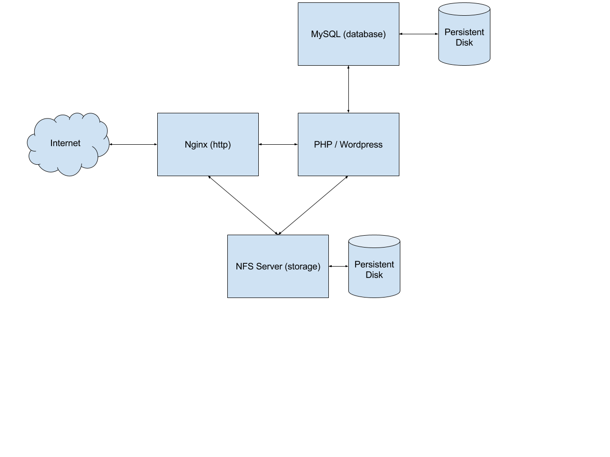

# Wordpress Example
Welcome to the Wordpress example. It shows you how to deploy a Wordpress application using Deployment Manager.

## Prerequisites
### Deployment Manager
First, make sure DM is installed in your Kubernetes cluster by following the instructions in the top level
[README.md](../../README.md).

### Google Cloud Resources
The Wordpress application will make use of several persistent disks, which we will host on Google Cloud. To create these disks we will create a deployment using Google Cloud Deployment Manager:
```gcloud deployment-manager deployments create wordpress-resources --config wordpress-resources.yaml```

where `wordpress-resources.yaml` looks as follows:

```
resources:
- name: nfs-disk
  type: compute.v1.disk
  properties:
    zone: us-central1-b
    sizeGb: 200
- name: mysql-disk
  type: compute.v1.disk
  properties:
    zone: us-central1-b
    sizeGb: 200
```

### Privileged containers
To use NFS we need to be able to launch privileged containers. Since the release of Kubernetes 1.1 privileged container support is enabled by default. If your Kubernetes cluster doesn't support privileged containers you need to manually change this by setting the flag at `kubernetes/saltbase/pillar/privilege.sls` to true.

### NFS Library
Mounting NFS volumes requires NFS libraries. Since the release of Kubernetes 1.1 the NFS libraries are installed by default. If they are not installed on your Kubernetes cluster you need to install them manually.

## Understanding the Wordpress example template
Let's take a closer look at the template used by the Wordpress example. The Wordpress application consists of 4 microservices: an nginx service, a wordpress-php service, a MySQL service, and an NFS service. The architecture looks as follows:



### Variables
The template contains the following variables:

```













                                                                                                                                                                                                                                                                                                                                                                                                                                                                                                                                                                                                                                                                                                                                                                                                                                                                                                     
```

### Nginx service
The nginx service is a replicated service with 2 replicas:

```
- name: nginx
  type: https://raw.githubusercontent.com/kubernetes/deployment-manager/master/templates/replicatedservice/v2/replicatedservice.py
  properties:
    service_port: {{ NGINX_PORT }}
    container_port: {{ NGINX_PORT }}
    replicas: {{ NGINX_REPLICAS }}
    external_service: true
    image: gcr.io/{{ PROJECT }}/nginx:latest
    volumes:
      - mount_path: /var/www/html
        persistentVolumeClaim:
          claimName: nfs
```

The nginx image builds upon the standard nginx image and simply copies a custom configuration file.

### Wordpress-php service
The wordpress-php service is a replicated service with 2 replicas:

```
- name: wordpress-php
  type: https://raw.githubusercontent.com/kubernetes/deployment-manager/master/templates/replicatedservice/v2/replicatedservice.py
  properties:
    service_name: wordpress-php
    service_port: {{ WORDPRESS_PHP_PORT }}
    container_port: {{ WORDPRESS_PHP_PORT }}
    replicas: 2
    image: wordpress:fpm
    env:
      - name: WORDPRESS_DB_PASSWORD
        value: {{ MYSQL_PASSWORD }}
      - name: WORDPRESS_DB_HOST
        value: mysql-service
    volumes:
      - mount_path: /var/www/html
        persistentVolumeClaim:
          claimName: nfs
```

### MySQL service
The MySQL service is a replicated service with a single replica:

```
- name: mysql
  type: https://raw.githubusercontent.com/kubernetes/deployment-manager/master/templates/replicatedservice/v2/replicatedservice.py
  properties:
    service_port: {{ MYSQL_PORT }}
    container_port: {{ MYSQL_PORT }}
    replicas: 1
    image: mysql:5.6
    env:
      - name: MYSQL_ROOT_PASSWORD
        value: {{ MYSQL_PASSWORD }}
    volumes:
      - mount_path: /var/lib/mysql
        gcePersistentDisk:
          pdName: {{ MYSQL_DISK }}
          fsType: {{ MYSQL_DISK_FSTYPE }}
```

### NFS service
The NFS service is a replicated service with a single replica that is available as a type:

```
- name: nfs
  type: https://raw.githubusercontent.com/kubernetes/deployment-manager/master/templates/nfs/v1/nfs.jinja
  properties:
    ip: {{ NFS_SERVER_IP }}
    port: {{ NFS_SERVER_PORT }}
    disk: {{ NFS_SERVER_DISK }}
    fstype: {{NFS_SERVER_DISK_FSTYPE }}
```

## Deploying Wordpress
We can now deploy Wordpress using:

```
dm deploy examples/wordpress/wordpress.yaml
```

where `wordpress.yaml` looks as follows:

```
imports:
- path: wordpress.jinja

resources:
- name: wordpress
  type: wordpress.jinja
  properties:
    project: <YOUR PROJECT>
```
